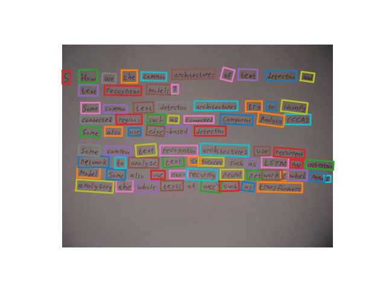
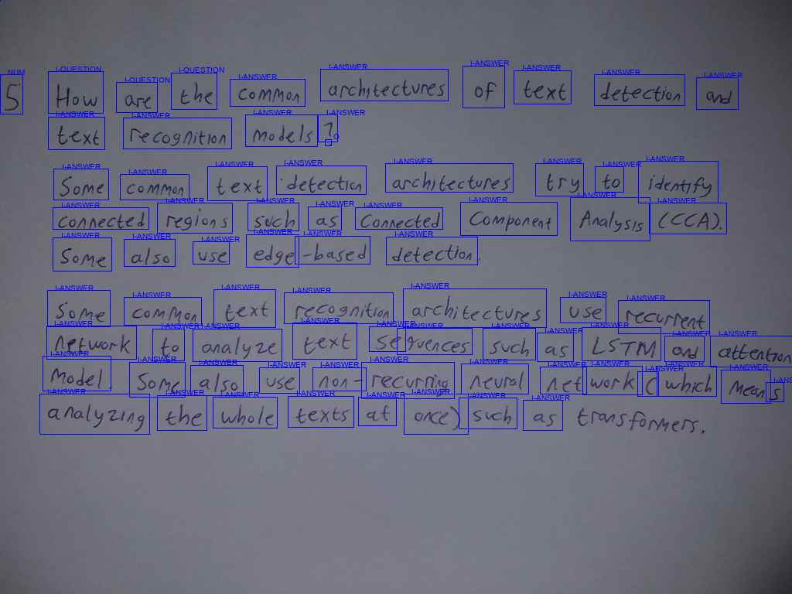

# OCR-and-Semantic-Entity-Recognition
I trained detection and recognition model using MMOCR, and then integrated it with SER Model trained using HuggingFace

For quick overview, this is how the image detection result will look like

And this is how the Semantic Entity Recognition will look like

And this is how the detection+recognition+result postprocessing result will compare to the ground truth. Apparently 0.0378 CER and 0.1711 WER were achieved which should be close enough to 0.
Ground Truth: 

5 How are the common architectures of text detection and text recognition models?

Some common text detection architectures try to identify connected regions such as Connected Component Analysis (CCA). Some also use edge-based detection.

Some common text recognition architectures use recurrent network to analyze text sequences such as LSTM and attention model. Some also use non-recurring neural network (which means analyzing the whole texts at once) such as transformers.

recognized text:

5 how are the common architectures of text detection and text recognition models 1  some common text detection architectures try to identify connected regions such as connected component analysis third some also use edge based detection some common text recognition architectures use recurrent network to analyze text se sequences such as stm and attention model some also use non recurring neural net work c which mean s analyzing the whole texts at once such as transformers

CER: 0.0378
WER: 0.1711

To use this project, simply unzip the ocr-and-ser zip file. And then download the MMOCR config folder from https://drive.google.com/drive/folders/15n6Mifgv83npPgg3bYwo8szx5tZTO10x?usp=sharing. Look for a file called mmocr.zip, and then unzip them into the same root directory. After that don't forget to install the requirements listed in requirements.txt.
